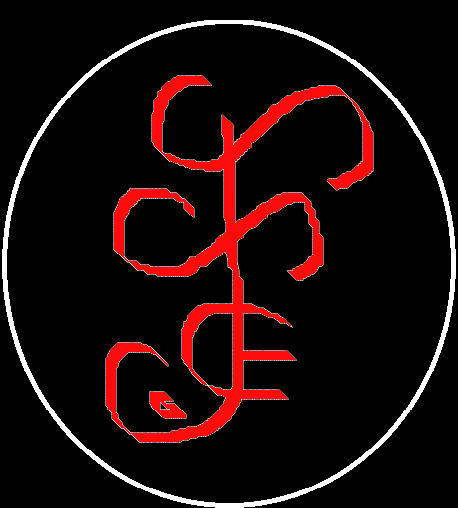

# Documentación del Framework [SETHAR]

  

 <!-- Espacio en blanco en el lado izquierdo -->
  

# Descripción
El Framework SETHAR es una herramienta diseñada para facilitar el desarrollo de aplicaciones web en PHP. Proporciona una estructura organizada y componentes reutilizables para acelerar el proceso de desarrollo y mejorar la mantenibilidad del código.

# Estructura del proyecto
El proyecto sigue la siguiente estructura de carpetas:

- app: Contiene la lógica de la aplicación.

- componentes:
  - base de datos: Aquí podrías tener archivos relacionados con la configuración y manejo de la base de datos, como la conexión y las consultas SQL.
  - interface: Podrías tener interfaces que definan contratos para componentes específicos de tu aplicación, como autenticación, envío de correos electrónicos, etc.
  - logs: Aquí podrías almacenar archivos de registro (logs) para rastrear errores o eventos importantes en tu aplicación.
  - tests: Podrías tener archivos de prueba para tus componentes, utilizando una herramienta de pruebas como PHPUnit.
  - traits: Aquí podrías tener traits reutilizables que contengan métodos comunes que se pueden usar en múltiples clases.
  - validacion: Podrías tener archivos relacionados con la validación de datos, como reglas de validación y funciones de validación personalizadas.
  - vendor: Esta carpeta puede ser generada por Composer y contendría las dependencias de terceros instaladas en tu proyecto.

- controlador:
  - interface: Aquí podrías tener interfaces que definan contratos para tus controladores, lo que ayuda a establecer un estándar en los métodos que deben implementar.
  - propiedades: Podrías tener archivos que contengan definiciones de propiedades y constantes que se utilizan en tus controladores.

- modelo:
  - entidades: Aquí podrías tener clases que representen las entidades o modelos de tu aplicación, mapeando a tablas de la base de datos.
  - interface: Podrías tener interfaces que definan contratos para tus modelos, especificando los métodos que deben implementar.

- recursos:
  - css: Aquí podrías almacenar tus archivos CSS para estilos personalizados.
  - js: Podrías tener tus archivos JavaScript para funcionalidades interactivas del lado del cliente.
  - img: Aquí podrías guardar las imágenes utilizadas en tu aplicación.
  - plugins: Podrías incluir bibliotecas o complementos de terceros utilizados en tu aplicación.
  - scss: Si utilizas Sass para escribir tus estilos, podrías tener archivos .scss aquí que se compilen en CSS.

- vista:
  - ejemplo: Ejemplo de una vista específica.
    - css: Aquí podrías almacenar los archivos CSS específicos para el módulo "ejemplo".
    - js: Aquí podrías tener los archivos JavaScript específicos para el módulo "ejemplo".
    - modal: Aquí podrías tener archivos relacionados con los modales específicos para el módulo "ejemplo".
  - publico: Aquí podrías tener archivos de plantillas para las páginas públicas de tu aplicación.
  - privado: Podrías tener archivos de plantillas para las páginas privadas o con acceso restringido.

- index.php: Punto de entrada de la aplicación.

# Configuración inicial
Antes de comenzar a utilizar el framework, siga los siguientes pasos de configuración:

Clone el repositorio [https://github.com/cheche482010/SETHAR] en su entorno local.
Instale las dependencias ejecutando el comando "composer install" en la raíz del proyecto.
Configure la conexión a la base de datos en el archivo de configuración "componentes/traits/Componentes.php".
Realice otras configuraciones necesarias según sus requisitos específicos.

# Uso del framework
El framework ofrece una estructura y componentes reutilizables para facilitar el desarrollo de aplicaciones web en PHP. A continuación, se describen los principales componentes del framework y cómo utilizarlos:

# Creación de Plantillas:
El script "crear_modulo.bat" ubicado en la carpeta "componentes" permite crear plantillas de módulos de forma automatizada. Este script realiza las siguientes acciones:

Solicita al usuario el nombre del nuevo módulo.
Utiliza PowerShell para generar archivos de modelo, entidad, controlador, propiedades y validación con el nombre proporcionado.
Ofrece la opción de crear la plantilla de validación para el módulo.
Controladores:
Los controladores se encuentran en la carpeta "controlador" y son responsables de manejar las solicitudes y generar las respuestas correspondientes. Siga las pautas establecidas en la documentación del framework para crear nuevos controladores.

# Modelos:
Los modelos se encuentran en la carpeta "modelo" y representan la lógica de negocio y la interacción con la base de datos. Siga las pautas establecidas en la documentación del framework para crear nuevos modelos.

# Vistas:
Las vistas se encuentran en la carpeta "vista" y son responsables de mostrar la interfaz de usuario al usuario final. Organice las vistas en subcarpetas según la funcionalidad o el contexto.

# Configuración adicional
Si necesita configurar componentes adicionales, como el enrutamiento, la autenticación, la validación o cualquier otro componente proporcionado por el framework, consulte la documentación específica de cada componente en la carpeta "componentes".

# Contribución
¡Nos encantaría recibir contribuciones de la comunidad! Si desea contribuir al desarrollo del framework, consulte las pautas de contribución en el archivo CONTRIBUTING.md en la raíz del proyecto.
